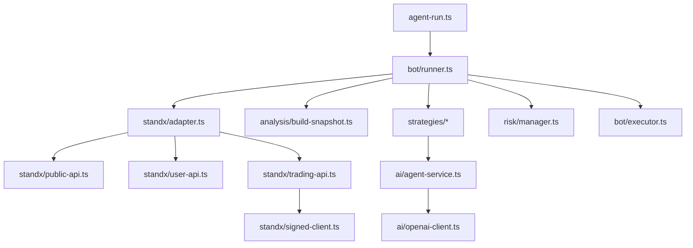

# Architecture

```mermaid
flowchart TB
  CLI[agent-run.ts] --> Runner[bot/runner.ts]
  Runner --> StandX[standx/adapter.ts]
  StandX --> Public[standx/public-api.ts]
  StandX --> User[standx/user-api.ts]
  StandX --> Trade[standx/trading-api.ts]
  Trade --> Signed[standx/signed-client.ts]
  Runner --> Analysis[analysis/build-snapshot.ts]
  Runner --> Strategy[strategies/*]
  Strategy --> AI[ai/agent-service.ts]
  AI --> LLM[ai/openai-client.ts]
  Runner --> Risk[risk/manager.ts]
  Runner --> Exec[bot/executor.ts]
```
